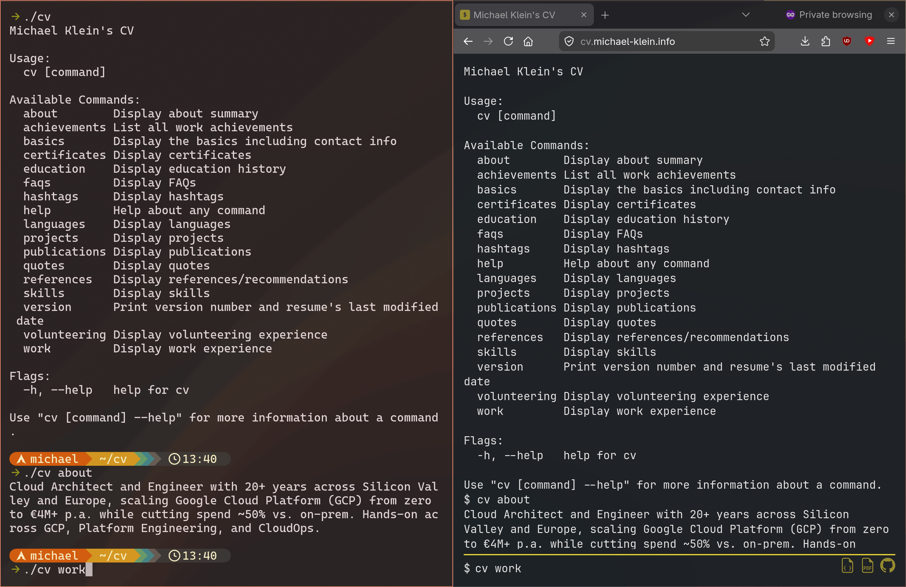

<h1 align="center"> My CV & CV (Web)CLI</h1>

<p align="center">

 (CV app)
 (CV data)
</p>

<p align="center">

<br />
<small>Left: CLI flavor<br />Right: WebCLI version</small>
</p>

<p align="center">
My CV, via command line interface, browser terminal, or HTTP API.
<br />
<a href="https://cv.michael-klein.info/"><strong>Browse CV »</strong></a>
<br />
<br />
<a href="https://cv.michael-klein.info/resume.pdf">Download PDF</a>
·
<a href="https://registry.jsonresume.org/m5lk3n">View on JSON Resume registry</a>
</p>

## ✨ Features

- [x] **JSON Resume**: Follows [this](https://jsonresume.org/) open-source initiative for a JSON-based standard for resumes.
- [x] **WebAssembly**: The same Go source compiles to a native CLI and a browser-side WASM module — one command tree, two targets.
- [x] **Single binary, no runtime I/O**: CV data is embedded at compile time via `//go:embed`, so the binary (and the WASM artifact) are self-contained.
- [x] **[Cobra](https://github.com/spf13/cobra) CLI**: One subcommand per CV section ([basics](cmd/basics.go), [work](cmd/work.go), [education](cmd/education.go), [skills](cmd/skills.go), [projects](cmd/projects.go), [certificates](cmd/certificates.go), [languages](cmd/languages.go), [publications](cmd/publications.go), [references](cmd/references.go), [volunteering](cmd/volunteering.go), …) plus extras like [about](cmd/about.go), [faqs](cmd/faqs.go), [hashtags](cmd/hashtags.go), [quotes](cmd/quotes.go), and [version](cmd/version.go).
- [x] **HTTP API**: A separate [`cvapi`](cvapi/main.go) binary serves each Cobra command as a typed JSON GET endpoint via [Gin](https://github.com/gin-gonic/gin), with structured logging ([log/slog](https://pkg.go.dev/log/slog)) and an interactive [Swagger UI](https://swagger.io/tools/swagger-ui/) at `/swagger`.
- [x] **Browser terminal**: Keystroke-driven shell in [web/index.html](web/index.html) with command history (↑/↓), `clear`, and `reset`; URLs and email addresses are rendered as clickable links.
- [x] **MIT-licensed tooling, All-Rights-Reserved data**: Fork the tool freely; bring your own [resume.json](resume/resume.json).

### Limitations

- Only English tool output is supported.

- The UX on smaller screens like smartphones needs improvement.

## 🛠 Built With/On

| Area | Technology |
| :--- | :--- |
| CLI  | [Go](https://go.dev/), [Cobra](https://github.com/spf13/cobra) |
| Web  | [WebAssembly](https://webassembly.org/) |
| API  | [Go](https://go.dev/), [Gin](https://github.com/gin-gonic/gin), [swaggo](https://github.com/swaggo/swag) |
| Data | [JSON Resume](https://jsonresume.org/) |

## 🏗 Architecture

One Go module, three entry points, one shared resume model:

- [main.go](main.go) builds a native CLI; [main_wasm.go](main_wasm.go) builds a WebAssembly module that exposes `cvRun(cmd)` to JavaScript. Build tags (`!js || !wasm` vs. `js && wasm`) pick the right entry per target.
- [cvapi/main.go](cvapi/main.go) is the HTTP API binary — a thin entry point that configures `slog` (JSON to stdout) and starts the Gin engine from [api/](api/).
- [cmd/](cmd/) holds the [Cobra](https://github.com/spf13/cobra) command tree — one file per CV section ([basics.go](cmd/basics.go), [work.go](cmd/work.go), [education.go](cmd/education.go), …). [root.go](cmd/root.go) exposes `Execute()` for the CLI and `RunCommand(input)` for the WASM build, which captures stdout/stderr into a buffer so the browser terminal can render it.
- [api/](api/) mirrors [cmd/](cmd/) one-for-one — each file declares a typed response entity, registers a `GET` route on the shared Gin engine via `init()`, and uses a small `loadResumeOrError` helper that emits a structured `slog.Error` on failure. Cross-cutting routes live alongside: a request-logging middleware, a Swagger UI at `/swagger` (with a 301 from bare `/swagger`), an embedded `/favicon.ico`, and a 404 fallback that logs a warning.
- [docs/](docs/) holds the Swagger 2.0 spec generated from doc-comment annotations by [`swag init`](https://github.com/swaggo/swag) (regenerate with `make generate-apidoc`; a [pre-commit hook](.githooks/pre-commit) keeps it from drifting).
- [resume/](resume/) defines the [JSON Resume](https://jsonresume.org/) schema as Go structs and embeds [resume.json](resume/resume.json) at compile time via `//go:embed`. The data ships inside every binary — no filesystem reads at runtime, which is what makes the WASM and API builds self-contained.
- [web/](web/) is the browser shell: [index.html](web/index.html) renders a terminal UI and wires keystrokes to `cvRun`; [wasm_exec.js](web/wasm_exec.js) is Go's standard WASM runtime loader; `cv.wasm` is the compiled artifact. [web/favicon.png](web/favicon.png) is the source of truth for the API's embedded favicon (`make assets` keeps `api/favicon.png` in sync).

```text
.
├── main.go              # CLI entry (build: !js || !wasm)
├── main_wasm.go         # WASM entry (build: js && wasm)
├── cmd/                 # Cobra commands — one per CV section
│   ├── root.go          # Execute() for CLI, RunCommand() for WASM
│   └── *.go             # basics, work, education, skills, …
├── api/                 # Gin handlers — one entity+route per Cobra command
│   ├── api.go           # router, slog middleware, error helper, /swagger, 404
│   ├── favicon.go       # /favicon.ico (embedded)
│   ├── favicon.png      # synced from web/favicon.png by `make assets`
│   └── *.go             # about, basics, work, … mirroring cmd/
├── cvapi/
│   └── main.go          # HTTP API binary entry point
├── docs/                # Generated Swagger spec — produced by `make generate-apidoc`
├── resume/
│   ├── resume.go        # JSON Resume structs + //go:embed loader
│   └── resume.json      # CV content (All Rights Reserved)
├── web/                 # Browser terminal hosting the WASM build
│   ├── index.html
│   ├── favicon.png      # source of truth, mirrored to api/
│   ├── robots.txt
│   ├── cv.wasm          # Generated using Makefile
│   ├── resume.pdf       # Generated using Makefile
│   └── wasm_exec.js
├── bin/                 # Build output (gitignored): bin/cv, bin/cvapi
└── .githooks/           # Versioned git hooks — run `make install-githooks`
```

## 🚀 Getting Started

To get a local copy up and running, follow these simple steps.

### Prerequisites

#### Web Server

A ([Caddy](https://caddyserver.com/)) web server location where to store static files (e.g., https://cv.example.com) is required. Have a look at [Makefile](Makefile)'s `publish-to-web` and `.env.example`'s `DEPLOY_TARGET` for implementation details. It should be relatively straightforward to customize the deployment to another web server.

#### Tooling

- Go 1.26+
- Optional: Python 3 (for the local web server)
- Optional: `jq` (for `make tidy`)
- Optional: [`gh`](https://cli.github.com/) (for `make publish-to-jsonresume`, authenticated via `gh auth login`)
- Optional: `chromium` (for `make export-pdf` / `make build-web`)
- Optional: `rsync` (for `make publish-to-web`)
- Optional: [`swag`](https://github.com/swaggo/swag) (for `make generate-apidoc` to regenerate the Swagger spec; install with `go install github.com/swaggo/swag/cmd/swag@latest`)

`make publish-to-jsonresume` publishes [resume/resume.json](resume/resume.json) (with the `x-cv` section stripped) to a GitHub gist, making the CV available under `https://registry.jsonresume.org/<your-github-user>`. The gist ID is read from a `.env` file at the repo root (`.env.example`'s `GIST_ID` for details):

```sh
GIST_ID=<your-gist-id>
```

`.env` is gitignored — create your own before running `make deploy`.

### Installation

```sh
git clone https://github.com/m5lk3n/cv.git
```

### Build

```sh
make build-cli       # native CLI              → bin/cv
make build-api       # HTTP API server         → bin/cvapi
make build-wasm      # WebAssembly             → web/cv.wasm
make build-web       # WebAssembly + PDF       → web/cv.wasm, web/resume.pdf
```

### Run

#### CLI

```sh
./bin/cv             # list available subcommands
./bin/cv basics
./bin/cv work
./bin/cv education
# etc.
```

#### Web

```sh
make run-localhost
```

Open http://localhost:8000 and type commands like `cv basics` at the prompt.

#### HTTP API

```sh
./bin/cvapi --addr=:8080
```

Then browse to http://localhost:8080/swagger for the interactive Swagger UI, or hit the JSON endpoints directly:

```sh
curl http://localhost:8080/about
curl http://localhost:8080/work
curl http://localhost:8080/work/achievements
```

There is one GET endpoint per Cobra command (plus `/swagger` and `/favicon.ico`); each request is logged as a structured JSON line via `slog`, and unknown paths return `404 {"error":"not found"}` with a warning logged.

### Develop

```sh
make tidy              # gofmt, go mod tidy, format resume.json
make generate-apidoc   # regenerate docs/ from API doc-comment annotations
make assets            # sync api/favicon.png from web/favicon.png
make install-githooks  # point git at .githooks/ (one-time, per clone)
make clean             # remove bin/, dist/, web/cv.wasm, web/resume.pdf
make help              # list all targets
```

The pre-commit hook in [.githooks/pre-commit](.githooks/pre-commit) regenerates the Swagger spec when `api/`, `cvapi/`, or `docs/` files are staged and aborts the commit if `docs/` is out of date — run `make install-githooks` once after cloning to opt in.

The CV content lives in [resume/resume.json](resume/resume.json) and is rendered by the subcommands in [cmd/](cmd/) and the handlers in [api/](api/).

## 🎯 Goals

My goals of this projects were to open-source my CV, give it a CLI, and to use Go with WebAssembly for that which I hadn't used before.

## ※ Disclaimer

I prompted Claude Opus 4.6, 4.7, and Claude Sonnet 4.6 to implement this project. However, I had learned and used almost all technologies used in this project before, without the help of AI.

## 📄 License

The code and tooling in this repository are released under the [MIT License](LICENSE).

The resume content in [resume/resume.json](resume/resume.json) is **not** covered by the MIT license — it is personal data and is **All Rights Reserved**. Please don't reuse, republish, or redistribute its contents as your own CV. Fork the tooling freely, but bring your own data.
